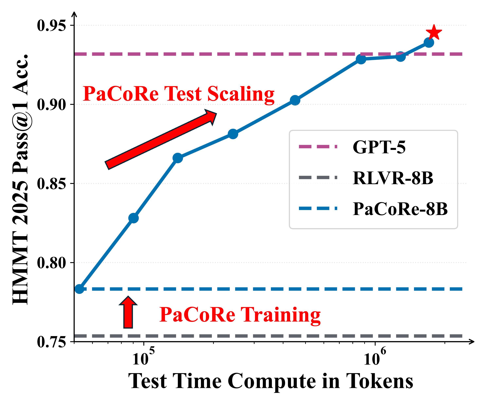
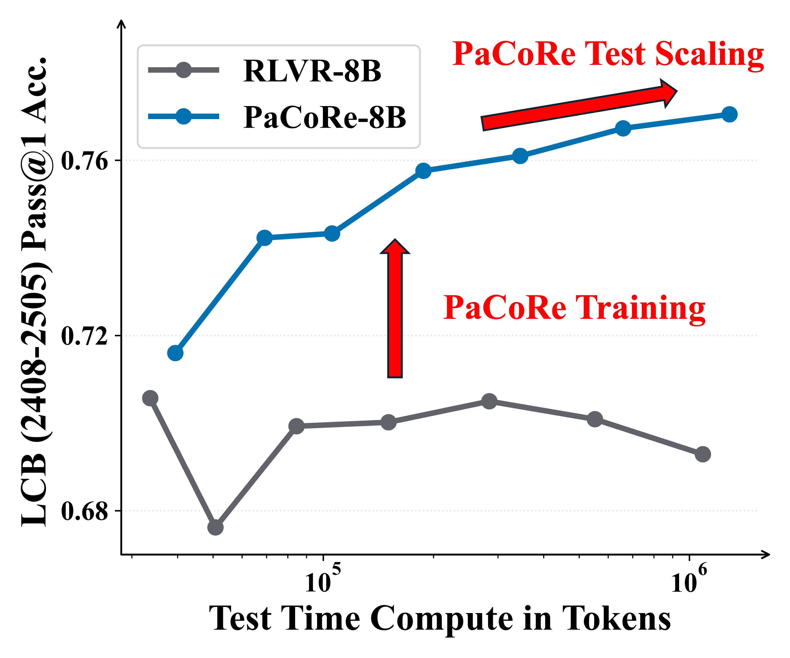
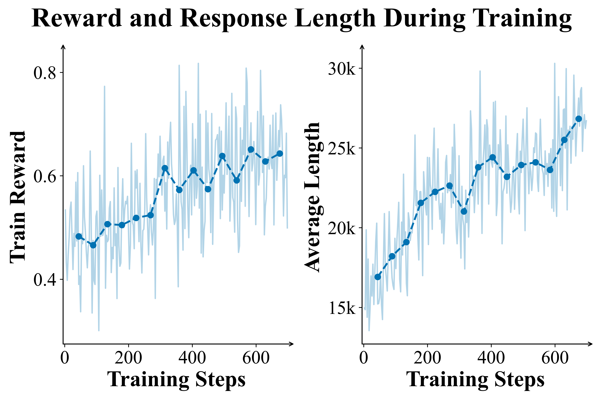
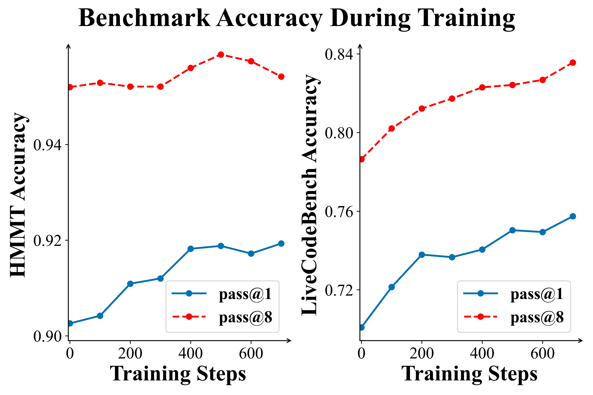

# PaCoRe: Learning to Scale Test-Time Compute with Parallel Coordinated Reasoning

<div align="center">

[**Read the Paper**](https://arxiv.org/abs/2601.05593) | [**Download Models**](https://huggingface.co/stepfun-ai/PaCoRe-8B) | [**Training Data**](https://huggingface.co/datasets/stepfun-ai/PaCoRe-Train-8k)

</div>

## 📖 Overview

We introduce **PaCoRe (Parallel Coordinated Reasoning)**, a framework that shifts the driver of inference from sequential depth to **coordinated parallel breadth**, breaking the model context limitation and massively scaling test time compute: 
*   **Think in Parallel:** PaCoRe launches massive parallel exploration trajectories.
*   **Coordinate in Multi-rounds:** It employs a message-passing architecture to compact these thoughts into concise messages and synthesize them to guide the next round.

Trained via large-scale, outcome-based reinforcement learning, PaCoRe masters the **Reasoning Synthesis** capabilities required to reconcile diverse parallel insights. 

The approach yields strong improvements across diverse domains, and notably pushes reasoning beyond frontier systems in mathematics: an 8B model reaches 94.5\% on HMMT 2025, surpassing GPT-5’s 93.2\% by scaling effective TTC to roughly two million tokens.

We open-source model checkpoints, training data, and the full inference pipeline to accelerate follow-up work!

------

<p align="center">
  
  
</p>

*Figure 1 | Parallel Coordinated Reasoning (PaCoRe) performance.  Left: On HMMT 2025, PaCoRe-8B demonstrates remarkable test-time scaling, yielding steady gains and ultimately surpassing GPT-5. Right: On LiveCodeBench, the RLVR-8B model fails to leverage increased test-time compute, while PaCoRe-8B model effectively unlocks substantial gains as the test-time compute increases.*

<p align="center">
  
  
</p>

*Figure 2 | PaCoRe Training dynamics. Left panels: The Training Reward and Response Length steadily increase, demonstrating the training stability and effectiveness. Right panels: Evaluation on HMMT 2025 and LiveCodeBench (2408-2505). Performance is reported using single round coordinated reasoning in PaCoRe inference setting with $\vec{K} = [16]$.*

## 🔥 Releases 

**[2025/12/09]** We are excited to release the **PaCoRe-8B** ecosystem:

*   📝 **In-depth Technical Report:** [**PaCoRe: Learning to Scale Test-Time Compute with Parallel Coordinated Reasoning.**](https://github.com/stepfun-ai/PaCoRe/blob/main/pacore_report.pdf)
*   🤖 **Model:** 
     * [PaCoRe-8B](https://huggingface.co/stepfun-ai/PaCoRe-8B): Our final PaCoRe-trained model checkpoint!
     * [RLVR-8B-0926](https://huggingface.co/stepfun-ai/RLVR-8B-0926): The initial checkpoint of our study, conducted strong reasoning-oriented post-trained on [Qwen3-8B-Base](https://huggingface.co/Qwen/Qwen3-8B-Base).
*   📚 **Data:** [PaCoRe-Train-8k](https://huggingface.co/datasets/stepfun-ai/PaCoRe-Train-8k) The high-quality training corpus, including `opensource_math`, `public_mathcontest`, `synthetic_math` and `code`: 
    * 🤗 Stage1-3k: [PaCoRe-Train-Stage1-3k](https://huggingface.co/datasets/stepfun-ai/PaCoRe-Train-8k/stage1)
    * 🤗 Stage2-5k: [PaCoRe-Train-Stage2-5k](https://huggingface.co/datasets/stepfun-ai/PaCoRe-Train-8k/stage2)

## 🔍 Experiments

<table class="tg">
<thead>
  <tr>
    <th class="tg-header"></th>
    <th class="tg-data">HMMT 2025</th>
    <th class="tg-data">LiveCodeBench (2408-2505)</th>
    <th class="tg-data">HLE<sub>text</sub></th>
    <th class="tg-data">MultiChallenge</th>
  </tr>
</thead>
<tbody>
  <tr>
    <td class="tg-header">GPT-5</td>
    <td class="tg-data">93.2 (16k)</td>
    <td class="tg-data"><b>83.5</b> (13k)</td>
    <td class="tg-data"><b>26.0</b> (14k)</td>
    <td class="tg-data"><b>71.1</b> (5.0k)</td>
  </tr>
  <tr>
    <td class="tg-header">Qwen3-235B-Thinking</td>
    <td class="tg-data">82.3 (32k)</td>
    <td class="tg-data">74.5 (21k)</td>
    <td class="tg-data">18.2 (23k)</td>
    <td class="tg-data">60.3 (1.6k)</td>
  </tr>
  <tr>
    <td class="tg-header">GLM-4.6</td>
    <td class="tg-data">88.7 (25k)</td>
    <td class="tg-data">79.5 (19k)</td>
    <td class="tg-data">17.2 (21k)</td>
    <td class="tg-data">54.9 (2.2k)</td>
  </tr>
  <tr>
    <td class="tg-header">DeepSeek-v3.1-Terminus</td>
    <td class="tg-data">86.1 (20k)</td>
    <td class="tg-data">74.9 (11k)</td>
    <td class="tg-data">19.3 (18k)</td>
    <td class="tg-data">54.4 (1.1k)</td>
  </tr>
  <tr class="tg-midrule">
    <td class="tg-header">Kimi-K2-Thinking</td>
    <td class="tg-data">86.5 (33k)</td>
    <td class="tg-data">79.2 (25k)</td>
    <td class="tg-data">23.9 (29k)</td>
    <td class="tg-data">66.4 (1.7k)</td>
  </tr>

  <tr class="tg-midrule">
    <td class="tg-header">RLVR-8B</td>
    <td class="tg-data">75.4 (48k)</td>
    <td class="tg-data">70.6 (34k)</td>
    <td class="tg-data">9.3 (35k)</td>
    <td class="tg-data">33.3 (1.7k)</td>
  </tr>

  <tr>
    <td class="tg-header"><b>PaCoRe-8B (low)</b></td>
    <td class="tg-data">88.2 (243k)</td>
    <td class="tg-data">75.8 (188k)</td>
    <td class="tg-data">13.0 (196k)</td>
    <td class="tg-data">41.8 (13k)</td>
  </tr>
  <tr>
    <td class="tg-header"><b>PaCoRe-8B (medium)</b></td>
    <td class="tg-data">92.9 (869k)</td>
    <td class="tg-data">76.7 (659k)</td>
    <td class="tg-data">14.6 (694k)</td>
    <td class="tg-data">45.7 (45k)</td>
  </tr>
  <tr class="tg-bottom">
    <td class="tg-header"><b>PaCoRe-8B (high)</b></td>
    <td class="tg-data"><b>94.5</b> (1796k)</td>
    <td class="tg-data">78.2 (1391k)</td>
    <td class="tg-data">16.2 (1451k)</td>
    <td class="tg-data">47.0 (95k)</td>
  </tr>
</tbody>
</table>

*Table 1 | For each benchmark, we report accuracy together with total TTC (in thousands). For *Low*, *Medium*, and *High*, we apply the inference trajectory configuration as $\vec{K}=[4]$, $[16]$, and $[32, 4]$ separately.*


### Key Findings
* **Message Passing Unlocks Scaling.** Without compaction, performance flatlines at the context limit. PaCoRe breaks the memory barrier and lets reasoning scale freely.
* **Breadth > Depth.** All compute is not equal. Coordinated parallel reasoning delivers far higher returns than extending a single chain. 
* **Data as a Force Multiplier.** The PaCoRe corpus provides exceptionally valuable supervision—even baseline models see substantial gains when trained on it.

## Getting Started 🚀
### Data
The data is provided as a `list[dict]`, where each entry represents a training instance:
*   `conversation`: The original problem/prompt messages.
*   `responses`: A list of cached generated responses (trajectories). These serve as the **input messages ($M$)** used during PaCoRe training.
*   `ground_truth`: The verifiable answer used for correctness evaluation.

### Model Serving
You can directly use `vllm serve` to serve the model! More inference details of PaCoRe will be handled in Inference Pipeline. 

### Inference Pipeline


*Figure 3 | Inference pipeline of PaCoRe. Each round launches broad parallel exploration, compacts the resulting trajectories into compacted messages, and feeds these messages together with the question forward to coordinate the next round.  Repeating this process $\hat{R}$ times yields multi-million-token effective TTC while respecting fixed context limits, with the final compacted message serving as the system’s answer.*

First, install this package:
```bash
pip install -e . 
```

Then, we assume you use vllm serve the model in your localhost with [PaCoRe-8B](https://huggingface.co/stepfun-ai/PaCoRe-8B) model.   

Next, you can run our example inference code with PaCoRe-low inference setting:
```
python playground/example_batch_inference_pacore_low_1210.py
```

And then you can see dumped results in `outputs/example_batch_inference_pacore_low_1210/results.jsonl`!


## 🙏 Acknowledgements
- This work was supported by computing resources and infrastructure provided by [StepFun](https://www.stepfun.com/) and Tsinghua University.
- We are deeply grateful to our colleagues for their support:
  * Inference: Song Yuan, Wuxun Xie, Mingliang Li, Bojun Wang.
  * Training: Xing Chen, Yuanwei Lu, Changyi Wan, Yu Zhou.
  * Infra Operations: Shaoliang Pang, Changxin Miao, Xu Zhao, Wei Zhang, Zidong Yang, Junzhe Lin, Yuxiang Yang, Chen Xu, Xin Li, Bin Wang.
  * Data Management: Xiaoxiao Ren, Zhiguo Huang, and Kang An.
  * Helpful Discussions: Liang Zhao, Jianjian Sun, Zejia Weng, JingJing Xie.
- We are grateful for colleagues from StepFun and Tsinghua University for their valuable feedback and contributions.
- Our work is built on amazing open source models and data; thanks again!

## 🔮 Future Work
We are just scratching the surface of parallel coordinated reasoning. Our roadmap includes:
- **Scaling the Extremes**: We plan to apply PaCoRe to stronger foundation models, expanding the task domains, and further scaling up both the breadth (parallel trajectories) and depth (coordination rounds) to tackle challenges currently deemed unsolvable.
- **Boosting Token Intelligence Density**: While we currently scale by volume, we aim to maximize the utility of every unit of compute spent. This involves enabling more efficient parallel exploration through better organization, cooperation, and division of labor among trajectories.
- **Emergent Multi-Agent Intelligence**: We are interested in exploring the joint training of both the synthesis policy and the message-passing mechanism, laying minimal yet rich cooperative multi-agent learning environment, offering a valuable playground for studying emergent communication, self-organization, and collective intelligence.
- **Ouroboros for Pre- and Post-Training**: we intend to investigate the development of advanced synthetic data generation techniques with PaCoRe pipeline to improve both current pretraining and post-training processes.

## Advertisement Time 📣
We are currently seeking self-motivated engineers and reseachers.
If you are interested in our project and would like to contribute to the reasoner scale-up all the way to AGI, please feel free to reach out to us at hanqer@stepfun.com

## 📜 Citation

```bibtex
@misc{pacore2025,
      title={PaCoRe: Learning to Scale Test-Time Compute with Parallel Coordinated Reasoning}, 
      author={Jingcheng Hu and Yinmin Zhang and Shijie Shang and Xiaobo Yang and Yue Peng and Zhewei Huang and Hebin Zhou and Xin Wu and Jie Cheng and Fanqi Wan and Xiangwen Kong and Chengyuan Yao and Kaiwen Yan and Ailin Huang and Hongyu Zhou and Qi Han and Zheng Ge and Daxin Jiang and Xiangyu Zhang and Heung-Yeung Shum},
      year={2026},
      eprint={2601.05593},
      archivePrefix={arXiv},
      primaryClass={cs.LG},
      url={https://arxiv.org/abs/2601.05593}, 
}
```
